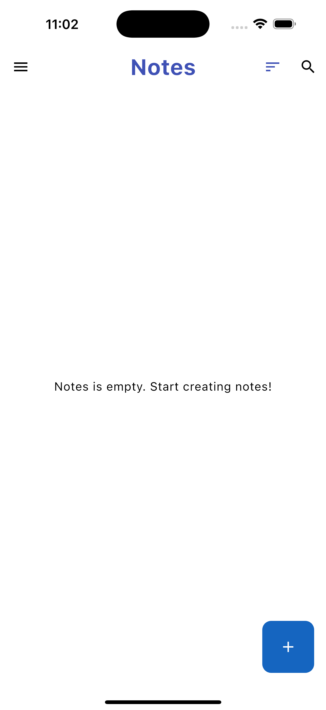
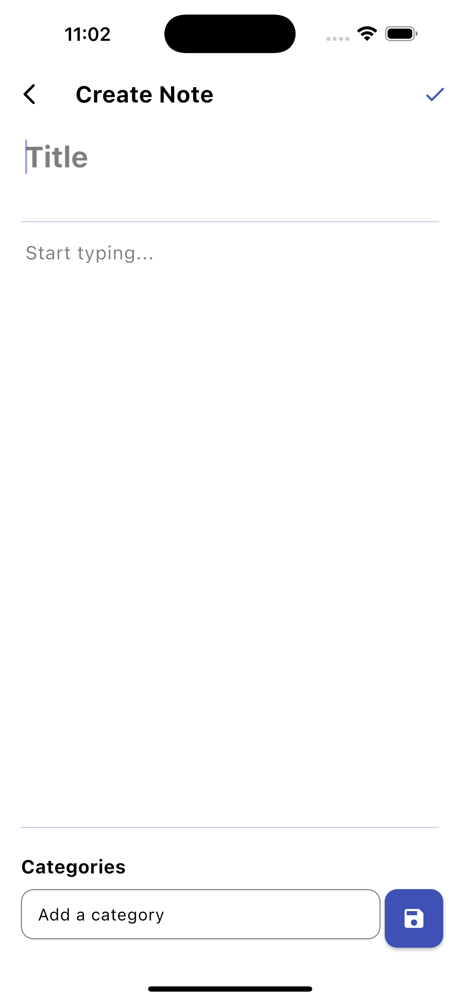
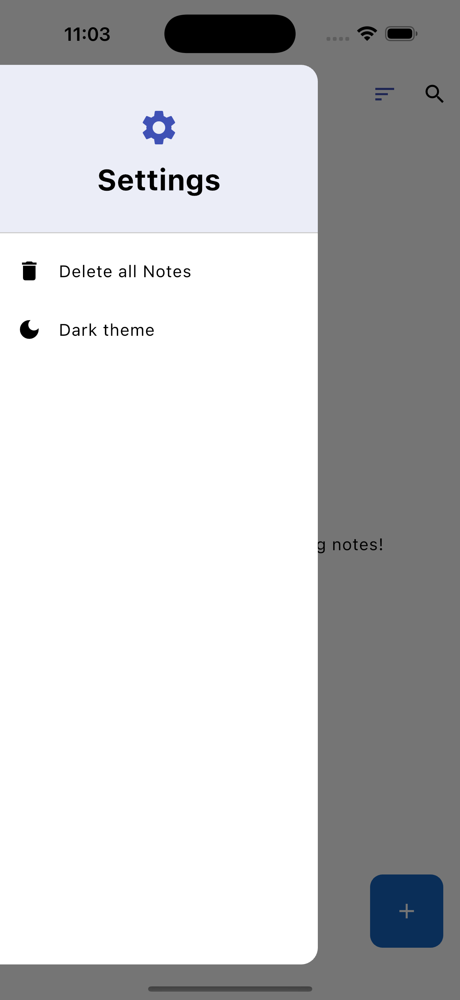
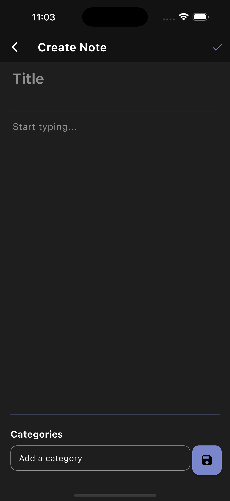
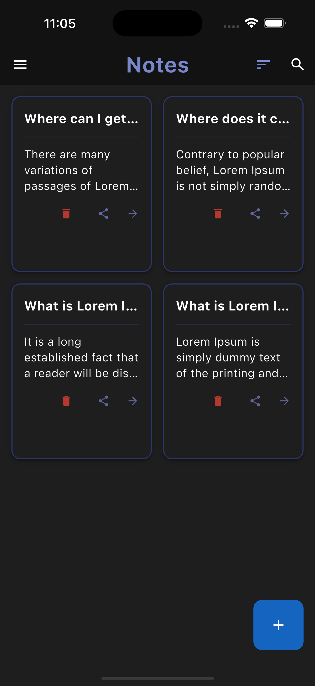
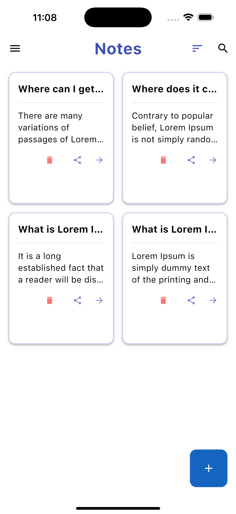
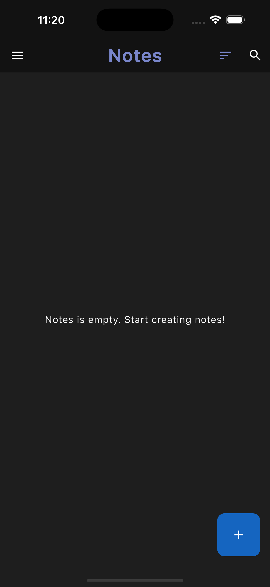

# Notes App

A modern, feature-rich note-taking application built with Flutter that allows users to create, edit, and manage notes with a clean and intuitive interface. The app supports both light and dark themes and uses local storage to ensure your notes are always available.

[](https://flutter.dev/)
[](https://dart.dev/)
[](LICENSE)

## Features

- ✏️ Create, read, update, and delete notes
- 🔍 Search and filter notes
- 🌓 Light and dark theme support
- 📱 Responsive design for various screen sizes
- 💾 Offline storage using Hive
- 🔒 Data persistence between app sessions
- 🧩 Clean architecture implementation
- 🏷️ Categories/Tags for better organization
- 📤 Share notes functionality

## Tech Stack & Dependencies

- **Flutter** - UI framework
- **Bloc Pattern** - State management via `flutter_bloc`
- **Hive** - Local NoSQL database
- **Get_it & Injectable** - Dependency injection
- **Dartz** - Functional programming
- **Equatable** - Value equality
- **UUID** - Unique identifiers
- **Share_plus** - Sharing content with other applications

## Project Structure

```
.
├── .gitignore
├── .metadata
├── README.md
├── analysis_options.yaml
├── android/
│   ├── .gitignore
│   ├── .kotlin/
│   │   └── sessions/
│   ├── app/
│   │   ├── build.gradle.kts
│   │   └── src/
│   ├── build.gradle.kts
│   ├── gradle/
│   │   └── wrapper/
│   ├── gradle.properties
│   └── settings.gradle.kts
├── ios/
│   ├── .gitignore
│   ├── Flutter/
│   │   ├── AppFrameworkInfo.plist
│   │   ├── Debug.xcconfig
│   │   └── Release.xcconfig
│   ├── Podfile
│   ├── Podfile.lock
│   ├── Runner/
│   │   ├── AppDelegate.swift
│   │   ├── Assets.xcassets/
│   │   ├── Base.lproj/
│   │   ├── Info.plist
│   │   └── Runner-Bridging-Header.h
│   ├── Runner.xcodeproj/
│   │   ├── project.pbxproj
│   │   ├── project.xcworkspace/
│   │   └── xcshareddata/
│   ├── Runner.xcworkspace/
│   │   ├── contents.xcworkspacedata
│   │   └── xcshareddata/
│   └── RunnerTests/
│       └── RunnerTests.swift
├── lib/
│   ├── core/
│   │   ├── config/
│   │   ├── error/
│   │   ├── modules/
│   │   ├── theme/
│   │   └── widgets/
│   ├── data/
│   │   ├── data_source/
│   │   ├── models/
│   │   └── repository/
│   ├── domain/
│   │   ├── entities/
│   │   ├── repository/
│   │   └── use_cases/
│   ├── hive/
│   │   └── data_source/
│   ├── main.dart
│   └── presentation/
│       ├── view/
│       └── view_model/
├── pubspec.lock
├── pubspec.yaml
├── screenshots/
│   ├── Simulator Screenshot - iPhone 16 Pro Max - 2025-09-28 at 23.02.42.png
│   ├── Simulator Screenshot - iPhone 16 Pro Max - 2025-09-28 at 23.02.59.png
│   ├── Simulator Screenshot - iPhone 16 Pro Max - 2025-09-28 at 23.03.12.png
│   ├── Simulator Screenshot - iPhone 16 Pro Max - 2025-09-28 at 23.03.21.png
│   ├── Simulator Screenshot - iPhone 16 Pro Max - 2025-09-28 at 23.03.26.png
│   ├── Simulator Screenshot - iPhone 16 Pro Max - 2025-09-28 at 23.05.15.png
│   └── Simulator Screenshot - iPhone 16 Pro Max - 2025-09-28 at 23.08.57.png
├── test/
│   └── widget_test.dart
└── web/
    ├── favicon.png
    ├── icons/
    │   ├── Icon-192.png
    │   ├── Icon-512.png
    │   ├── Icon-maskable-192.png
    │   └── Icon-maskable-512.png
    ├── index.html
    └── manifest.json
```

## Screenshots

### Main Interface

| Light Theme - Notes List | Dark Theme - Notes List | Create New Note |
|---|---|---|
|  |  |  |

### Note Management

| Edit Existing Note | Search Functionality | Note Categories |
|---|---|---|
|  |  |  |

### Additional Features

| Navigation Drawer | App Settings |
|---|---|
|  |  |


## Getting Started

To get a local copy up and running, follow these simple steps.

### Prerequisites

- Flutter SDK installed (version 3.8.1 or higher)
- Dart SDK installed (version 3.8.1 or higher)

### Installation

1. Clone the repo
   ```sh
   git clone https://github.com/your_username/notes_app.git
   ```
2. Navigate to the project directory
   ```sh
   cd notes_app
   ```
3. Install Flutter packages
   ```sh
   flutter pub get
   ```
4. Run the app
   ```sh
   flutter run
   ```

## Usage

- **Create Note**: Tap the '+' button to create a new note.
- **Edit Note**: Tap on an existing note to edit its title, content, or categories.
- **Delete Note**: Tap the trash icon on a note card to delete it.
- **Search Notes**: Use the search icon in the app bar to filter notes by title or content.
- **Change Theme**: Open the drawer from the left and toggle between light and dark themes.
- **Delete All Notes**: Open the drawer and select "Delete all Notes" to clear all your notes.
- **Share Note**: Tap the share icon on a note card to share its content.

## Contributing

Contributions are what make the open source community such an amazing place to learn, inspire, and create. Any contributions you make are **greatly appreciated**.

If you have a suggestion that would make this better, please fork the repo and create a pull request. You can also simply open an issue with the tag "enhancement".
Don't forget to give the project a star! Thanks again!

1. Fork the Project
2. Create your Feature Branch (`git checkout -b feature/AmazingFeature`)
3. Commit your Changes (`git commit -m 'Add some AmazingFeature'`)
4. Push to the Branch (`git push origin feature/AmazingFeature`)
5. Open a Pull Request

## License

Distributed under the MIT License. See `LICENSE` for more information.

## Contact

Your Name - your_email@example.com

Project Link: [https://github.com/your_username/notes_app](https://github.com/your_username/notes_app)